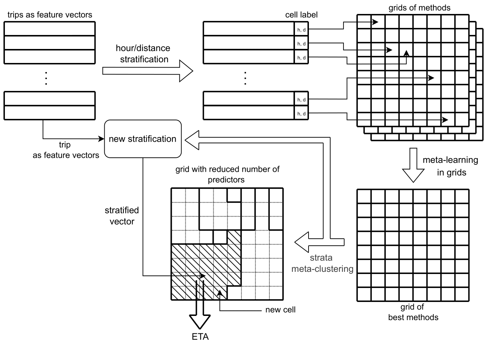
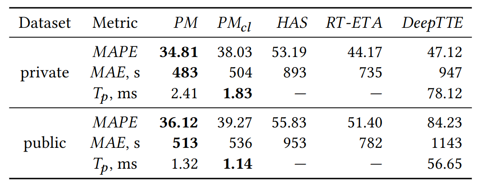

This repository contains data collected by [StarLine Ltd](https://https://www.starline.ru/). 
on a course of one weekday in November 2021.

## Abstract

Methods providing the Estimated Time of Arrival (ETA) of a car have wide applications in  trip planning and time management. 
Considering the complexity of a modern city, ETA prediction is a challenging task that is performed nowadays by more 
and more complex solutions such as Deep Learning (neural) techniques, 
often with the claim of a substantial progress in ETA prediction quality. 

Nevertheless, as in the area of other data mining tasks,
indications exist of certain reprodicibility problems in today's research practice
connected with the choice of state-of-the-art ETA prediction methods.
The purpose of our study is to shed light on the problems via an overview of studies proposing 
new ETA prediction methods and the related reproducibility issues 
(including the availability of open source code and datasets, especially of GPS trajectory data).

Furthermore, motivated by the recent observations in the field of recommender systems 
that the majority of existing neural approaches can be outperformed by traditional simple  methods, 
we perform an experimental study that surprisingly shows that a fine-tuned combination of simple 
regression-based ETA prediction methods (we call it ***Strat-mETA***) can indeed outperform 
more complex solutions (including Deep Learning-based) by means of a multi-component quality metric.

We perform the study on a new real-world car travel dataset of GPS trajectory data 
and make its part public as a benchmark in order to encourage future research 
and partly resolve the problem of reproducibility in the field.

## Data

- `data/tracks.7z` file contains csv with raw GPS points aggregated in tracks.

|         	         | ***N<sub>p</sub>*** 	 | ***N<sub>t</sub>***	 | ***d<sub>p</sub>***, m  	 | ***t<sub>p</sub>***, s 	 | ***L***, m 	 | ***T***, s 	 |
|:-----------------:|:---------------------:|:--------------------:|:-------------------------:|:------------------------:|:------------:|:------------:|
| ***tracks.7z*** 	 |      27M      	       |     515,169    	     |       4.4        	        |       3.7       	        |   1,834 	    |   279    	   |

***N<sub>p</sub>*** is the number of GPS points in the dataset, 
***N<sub>t</sub>*** the number of tracks, 
***d<sub>p</sub>*** the average distance between two consequent GPS points, 
***t<sub>p</sub>*** the average interval between two consequent GPS points' timestamps,
***L*** the average distance of a trip, 
***T*** the average duration of a trip.

- `data/train_dataset.csv` file contains processed tracks with traffic information. 

The traffic information is represented as congestion index ***r*** and calculated as a ratio between the current speed of 
vehicles on the road segment and the free speed ***v<sub>free<sub>*** of the segment 
(when there is no congestion and vehicles are freely passing through it), provided by StarLine Ltd. 
Historical data is used to estimate ***v<sub>free<sub>*** as average speed of vehicles on the road segment,
generally late at night. Based on the value of the congestion index, each road segment is classified as:

- jammed, if ***r*** in [0, 0.25),
- slow, if **_r_** in [0.25, 0.5),
- normal, if **_r_** in [0.5, 0.75),
- free, if _**r**_ in [0.75, +infinity).

## ***Strat-mETA***

We stratify the data by two features (hour of the day and distance buckets), 
so it is easy to represent it as a 2D-grid. 
Considering it, we propose to treat each grid cell of the stratified dataset as a separate task.

In order to pick best model for each grid cell, 
the following approach is proposed: using genetic algorithm, 
we train several models for each grid cell of data. 
Then, the best method for each cell on the grid is picked based on the fitness function 
of optimized model. In order to reduce number of trained estimators we propose
a ***meta-clustering*** - clustering based on meta-information acquired during training process.

The prediction is made based on the class the input trip is assigned to:
the appropriate model is selected from the grid based on the trip's class. 



## Experiments

For experimental studies the following notebooks were used

#### multiobj_optimization.ipynb
The notebook contains example of usage of `GeneticMetaEstimator` class and wrappers 
for possible base estimators as well as process of grid-based training on a grid-stratified data. 

#### select_best.ipynb
The notebook process of constructing grid of the best optimizers as well as meta-clustering step.

## Experimental results
In total five methods of ETA prediction were compared:

- ***PM*** that is an abbreviation for ***Strat-mETA***
without the clusterization step;
- ***PM<sub>cl<sub>*** that is an abbreviation for ***Strat-mETA*** 
with the clusterization step;
- ***HAS*** (Al-Naim, R., & Lytkin, Y. , 2021) that stands for
Historical Average Speeds approach where
ETA is computed based on speeds of vehicles collected 
before the actual time of the trip; average speed values is computed
for each 15 minutes using the whole dataset;
- ***RT-ETA*** (Derrow-Pinion, Austin, et al, 2021) that stands for Real-time Travel Times is similar to HAS 
but real-time speeds of vehicles are used for ETA prediction; 
for each 10-minute interval in the dataset average speed values 
are computed using the data from the previous 10 minutes;
- ***DeepTTE*** (Wang, D., Zhang, J., Cao, W., Li, J., & Zheng, Y. , 2018, April) is a Deep Neural Network processing trip data as sequences of GPS points; its hyperparameters are set to the default ones proposed by its authors



## Installation
Required Python 3.6

`pip install -r requirements.txt`

## Cite
```
@inproceedings{al2022reproducibility,
  title={Reproducibility and Progress in Estimating Time of Arrival, or Can Simple Methods Still Outperform Deep Learning Ones?},
  author={Al-Naim, Rami and Chunaev, Petr and Bochenina, Klavdiya},
  booktitle={Conference on Knowledge Discovery and Data Mining},
  year={2022}
}
```